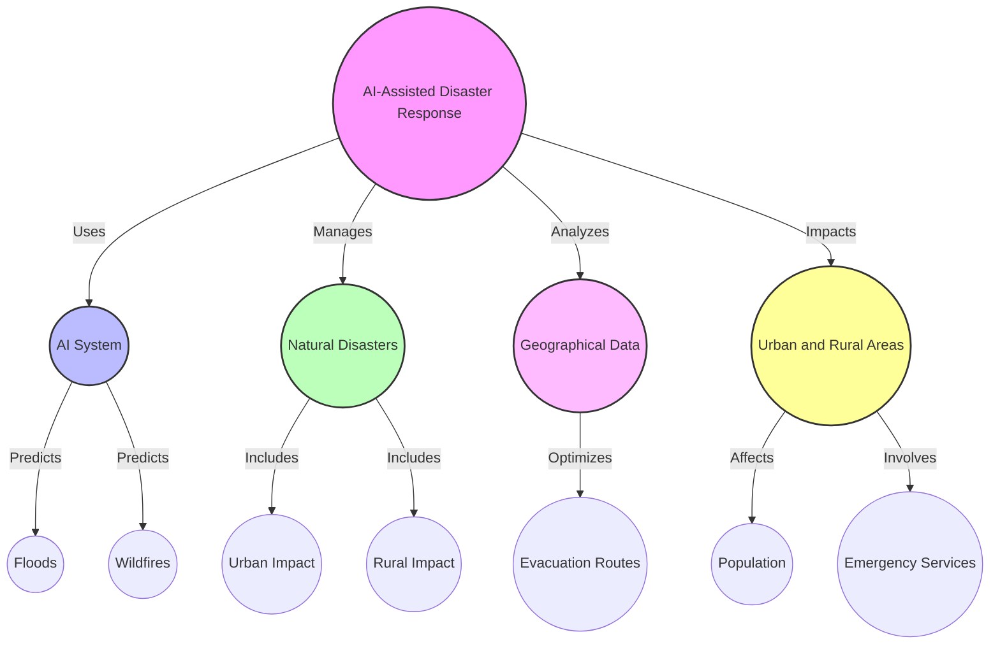
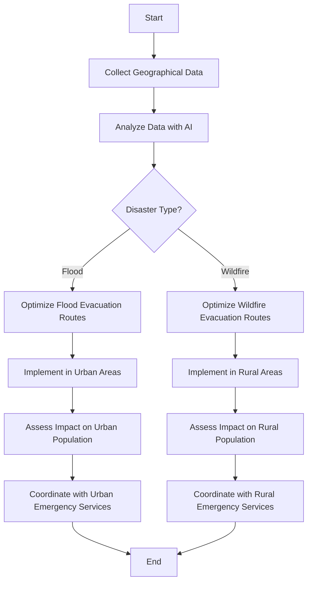
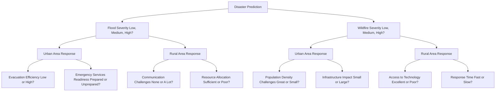
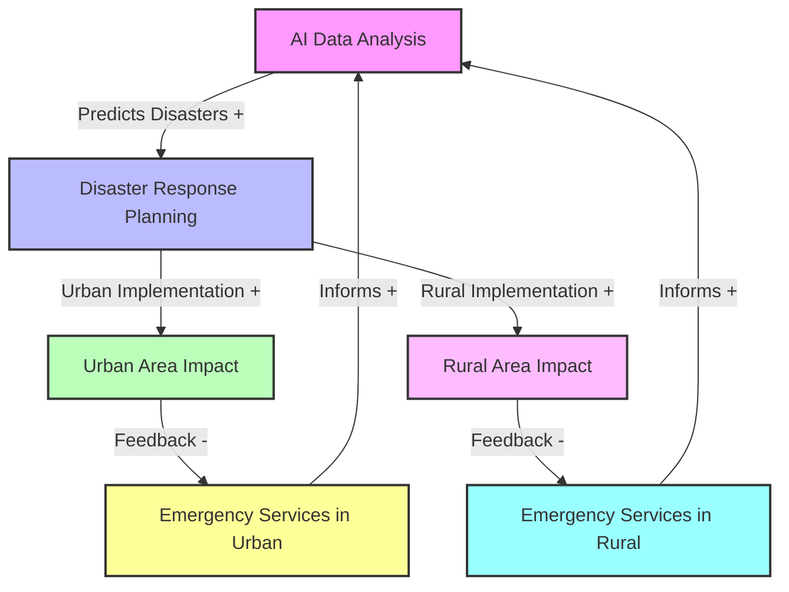

# Problem Prompt
#### AI-Assisted Disaster Response and Management:

- **Scenario:** An organization develops an AI system to predict and manage natural disasters, like floods or wildfires. The system analyzes geographical data to predict disaster zones and optimize evacuation routes.
- **Task:** Assess the spatial implications of this system. How does it affect rural vs. urban areas? Consider the geographical accuracy of predictions, the impact on populations in varied terrains, and the integration with local emergency services.

## Mind Map Example

## Flow Chart Example

## Scenario Tree Example

## Causal Loop Diagram Example

      
