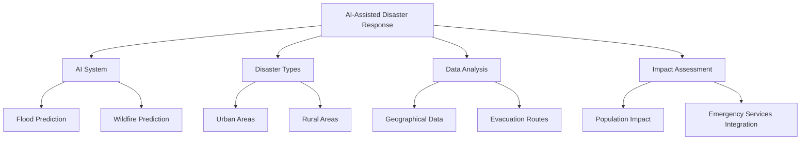
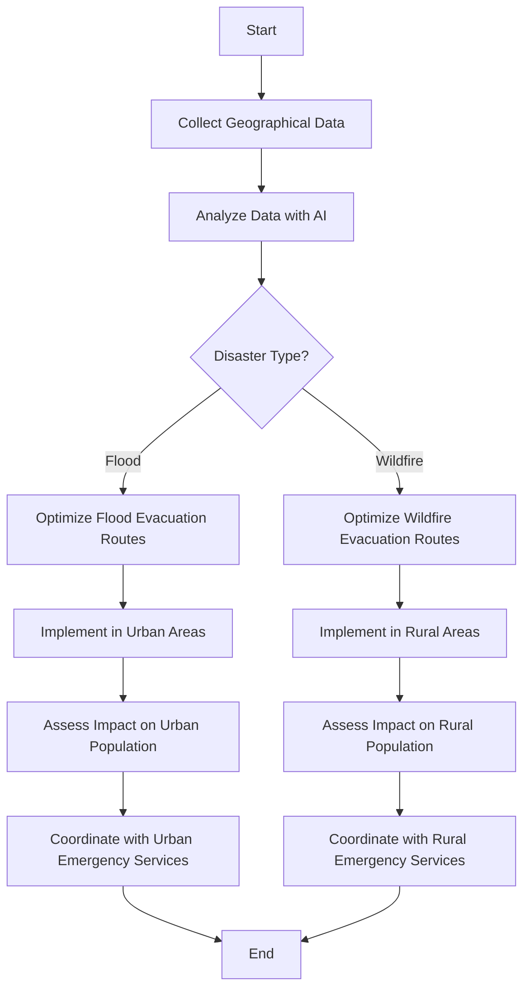
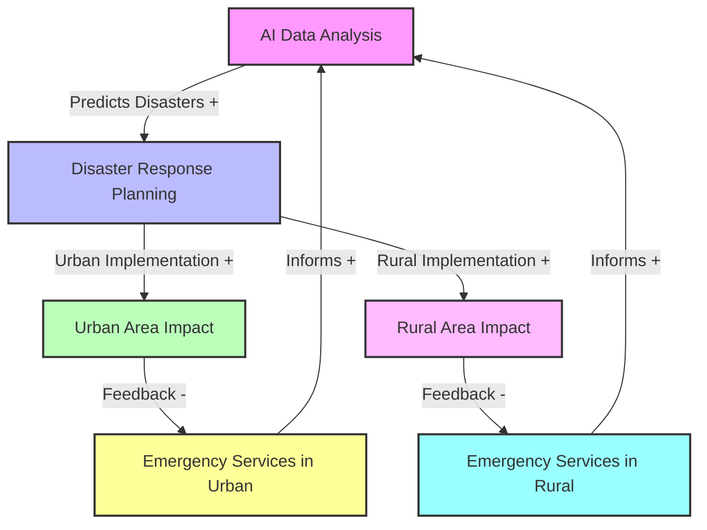

## Mind Map Example



## Flow Chart Example


## Scenario Tree Example

```mermaid
subgraph TD
    style A fill:#f9f,stroke:#333,stroke-width:2px
    A((AI-Assisted Disaster Response)) -->|Uses| B((AI System))
    A -->|Manages| C((Natural Disasters))
    A -->|Analyzes| D((Geographical Data))
    A -->|Impacts| E((Urban and Rural Areas))
    B -->|Predicts| B1((Floods))
    B -->|Predicts| B2((Wildfires))
    C -->|Includes| C1((Urban Impact))
    C -->|Includes| C2((Rural Impact))
    D -->|Optimizes| D1((Evacuation Routes))
    E -->|Affects| E1((Population))
    E -->|Involves| E2((Emergency Services))

    style B fill:#bbf,stroke:#333,stroke-width:2px
    style C fill:#bfb,stroke:#333,stroke-width:2px
    style D fill:#fbf,stroke:#333,stroke-width:2px
    style E fill:#ff9,stroke:#333,stroke-width:2px

```


## Causal Loop Diagram Example


      
