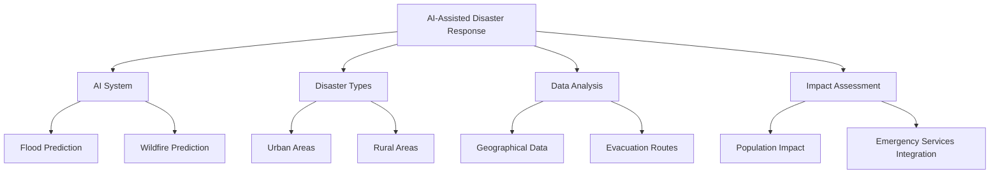
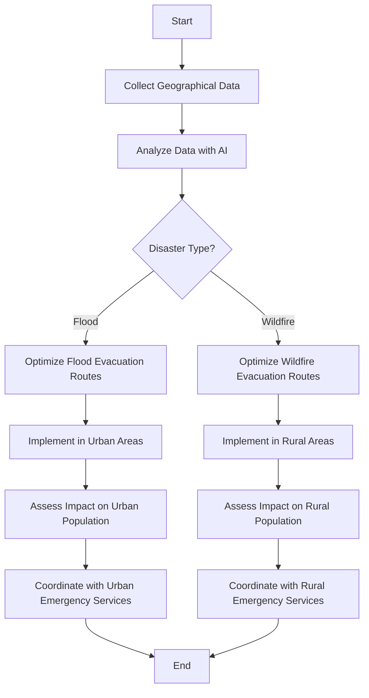
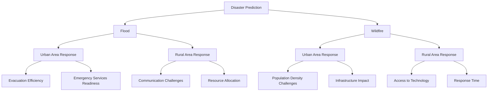
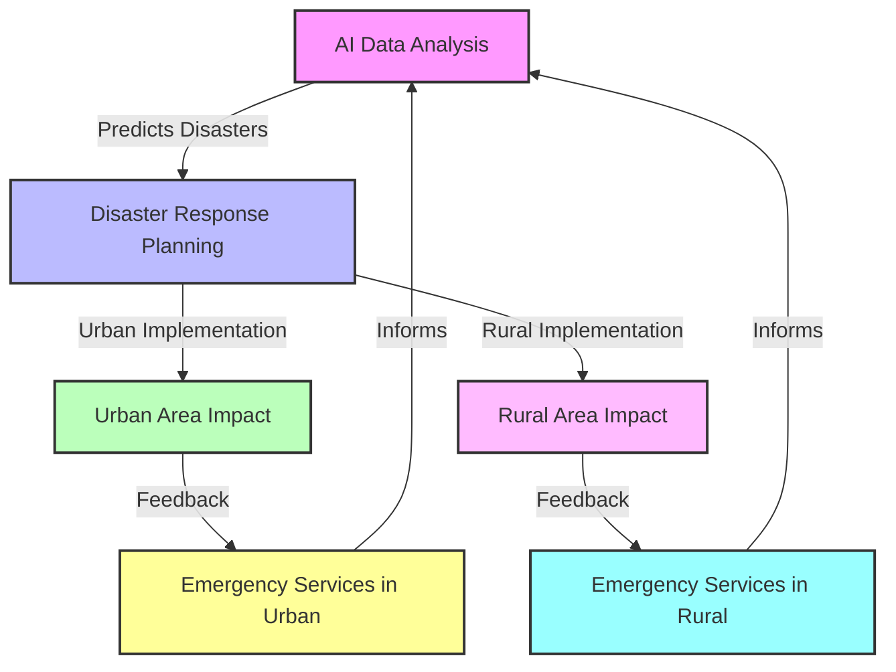

## Mind Map Example

```mermaid
graph TD
    A[AI-Assisted Disaster Response] --> B[AI System]
    A --> C[Disaster Types]
    A --> D[Data Analysis]
    A --> E[Impact Assessment]
    B --> B1[Flood Prediction]
    B --> B2[Wildfire Prediction]
    C --> C1[Urban Areas]
    C --> C2[Rural Areas]
    D --> D1[Geographical Data]
    D --> D2[Evacuation Routes]
    E --> E1[Population Impact]
    E --> E2[Emergency Services Integration]
```

## Flow Chart Example

```mermaid
graph TD
    A[Start] --> B[Collect Geographical Data]
    B --> C[Analyze Data with AI]
    C --> D{Disaster Type?}
    D -->|Flood| E[Optimize Flood Evacuation Routes]
    D -->|Wildfire| F[Optimize Wildfire Evacuation Routes]
    E --> G[Implement in Urban Areas]
    F --> H[Implement in Rural Areas]
    G --> I[Assess Impact on Urban Population]
    H --> J[Assess Impact on Rural Population]
    I --> K[Coordinate with Urban Emergency Services]
    J --> L[Coordinate with Rural Emergency Services]
    K --> M[End]
    L --> M

```

## Scenario Tree Example

```mermaid
graph TD
    A[Disaster Prediction] --> B[Flood]
    A --> C[Wildfire]
    B --> D[Urban Area Response]
    B --> E[Rural Area Response]
    C --> F[Urban Area Response]
    C --> G[Rural Area Response]
    D --> D1[Evacuation Efficiency]
    D --> D2[Emergency Services Readiness]
    E --> E1[Communication Challenges]
    E --> E2[Resource Allocation]
    F --> F1[Population Density Challenges]
    F --> F2[Infrastructure Impact]
    G --> G1[Access to Technology]
    G --> G2[Response Time]

```

## Causal Loop Diagram Example

```mermaid
graph TD
    A[AI Data Analysis] -->|Predicts Disasters| B[Disaster Response Planning]
    B -->|Urban Implementation| C[Urban Area Impact]
    B -->|Rural Implementation| D[Rural Area Impact]
    C -->|Feedback| E[Emergency Services in Urban]
    D -->|Feedback| F[Emergency Services in Rural]
    E -->|Informs| A
    F -->|Informs| A

    style A fill:#f9f,stroke:#333,stroke-width:2px
    style B fill:#bbf,stroke:#333,stroke-width:2px
    style C fill:#bfb,stroke:#333,stroke-width:2px
    style D fill:#fbf,stroke:#333,stroke-width:2px
    style E fill:#ff9,stroke:#333,stroke-width:2px
    style F fill:#9ff,stroke:#333,stroke-width:2px

```
      
